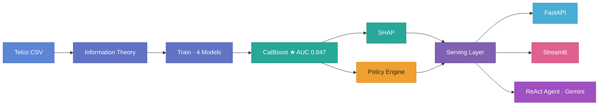
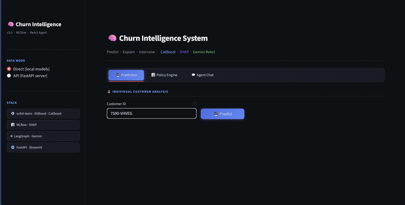
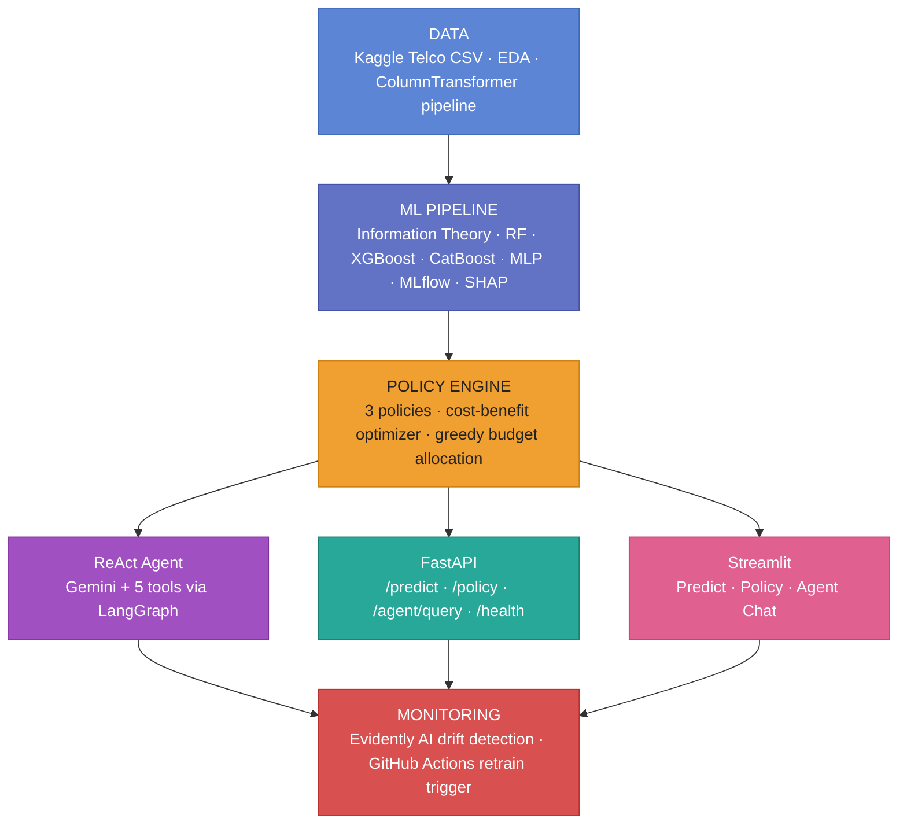
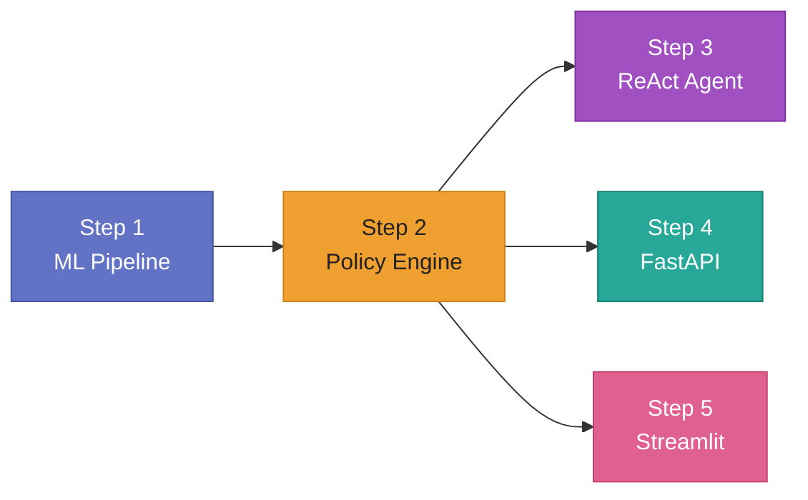
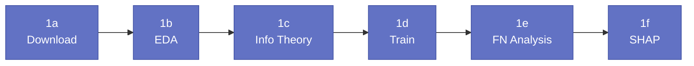
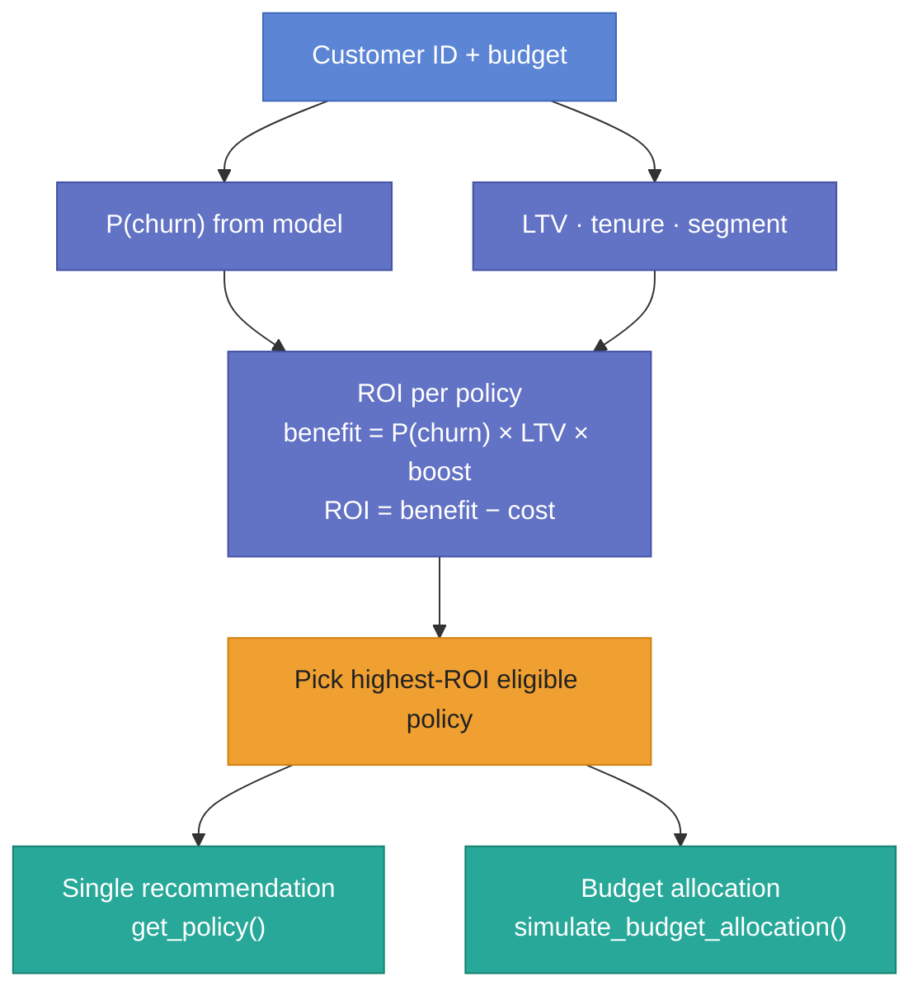
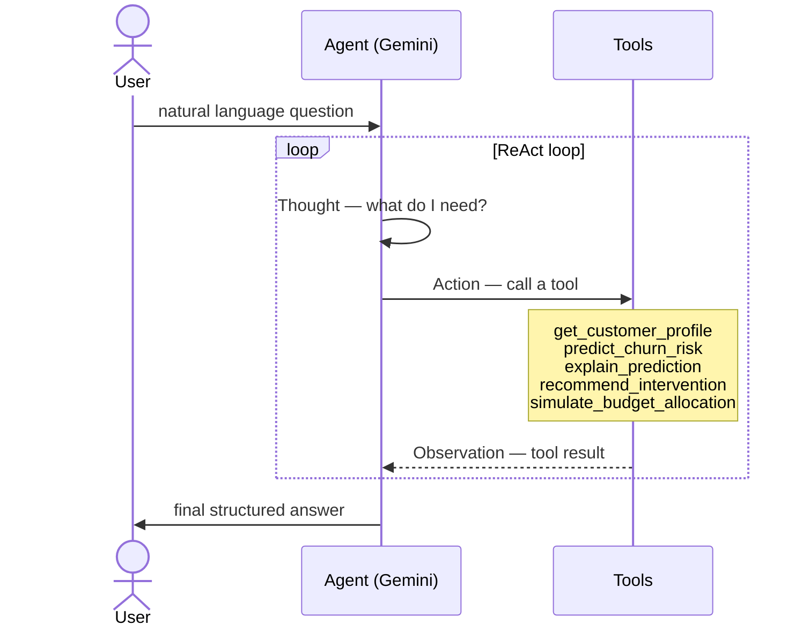
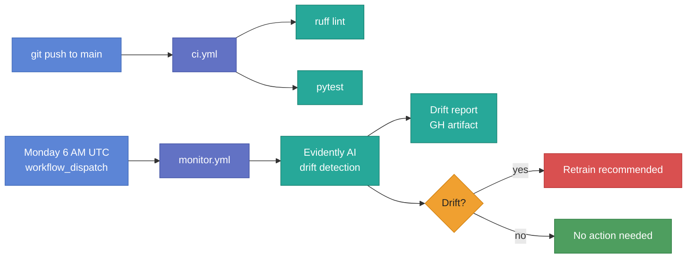

# Churn Intelligence System v3

[](https://www.python.org/)
[](https://mlflow.org/)
[](https://fastapi.tiangolo.com/)
[](https://streamlit.io/)
[](https://langchain-ai.github.io/langgraph/)
[](LICENSE)

> End-to-end ML system that predicts telecom customer churn, explains predictions with SHAP, optimizes retention budgets via a policy engine, and exposes everything through a conversational ReAct agent.

---

## Executive Summary

This system answers one business question: **which customers are about to leave, and what should we do about it?**

We train four models (Random Forest, XGBoost, CatBoost, MLP) on the Kaggle Telco churn dataset. The best model — CatBoost with all 54 features — reaches ROC-AUC **0.847**. We use information theory to validate features before training, SHAP to explain individual predictions after training, and a policy engine that translates each prediction into a concrete retention action with an expected ROI.

Everything is accessible three ways: a FastAPI REST API, a Streamlit UI with three tabs, and a conversational ReAct agent powered by Gemini that a retention manager can query in plain English.



---




## Table of Contents

- [Architecture](#architecture)
- [Key Results](#key-results)
- [Tech Stack](#tech-stack)
- [Project Structure](#project-structure)
- [Quick Start](#quick-start)
- [Configuration](#configuration)
- [Usage](#usage)
  - [Step 1 — Build the ML Pipeline](#step-1--build-the-ml-pipeline)
  - [Step 2 — Policy Engine](#step-2--policy-engine)
  - [Step 3 — ReAct Agent](#step-3--react-agent)
  - [Step 4 — REST API](#step-4--rest-api)
  - [Step 5 — Streamlit UI](#step-5--streamlit-ui)
- [Docker Deployment](#docker-deployment)
- [CI/CD & Monitoring](#cicd--monitoring)
- [Approach: Pros and Cons](#approach-pros-and-cons)
- [License](#license)

---

## Architecture

The system is built in layers. Each layer depends on the one above it.



---

## Key Results

Performance over **10 repeated runs** (seeds 0–9, stratified 80/20 split).
Decision threshold selected by **out-of-fold F1-Macro optimization** on the training set.

### Feature set: `all` (54 features)

| Model | ROC-AUC | F1-Macro | F1-Churn |
|---|---|---|---|
| Dummy | 0.4995 ± 0.0105 | 0.4994 ± 0.0106 | 0.2630 ± 0.0170 |
| Random Forest | 0.8428 ± 0.0119 | 0.7356 ± 0.0109 | 0.6226 ± 0.0145 |
| XGBoost | 0.8452 ± 0.0118 | 0.7388 ± 0.0129 | 0.6228 ± 0.0177 |
| MLP | 0.8460 ± 0.0103 | 0.7337 ± 0.0116 | 0.6151 ± 0.0249 |
| **CatBoost** ★ | **0.8467 ± 0.0120** | **0.7428 ± 0.0110** | **0.6287 ± 0.0152** |

### Feature set: `mi` — Mutual Information selected (40 features)

| Model | ROC-AUC | F1-Macro | F1-Churn |
|---|---|---|---|
| Dummy | 0.4995 ± 0.0105 | 0.4994 ± 0.0106 | 0.2630 ± 0.0170 |
| Random Forest | 0.8422 ± 0.0120 | 0.7378 ± 0.0128 | 0.6280 ± 0.0184 |
| XGBoost | 0.8439 ± 0.0125 | 0.7360 ± 0.0120 | 0.6199 ± 0.0181 |
| MLP | 0.8446 ± 0.0127 | 0.7356 ± 0.0107 | 0.6215 ± 0.0172 |
| **CatBoost** | **0.8457 ± 0.0123** | **0.7402 ± 0.0093** | **0.6241 ± 0.0167** |

### Feature set: `hill_climbing` (10 features)

| Model | ROC-AUC | F1-Macro | F1-Churn |
|---|---|---|---|
| Dummy | 0.4995 ± 0.0105 | 0.4994 ± 0.0106 | 0.2630 ± 0.0170 |
| MLP | 0.8371 ± 0.0171 | 0.7345 ± 0.0129 | 0.6138 ± 0.0257 |
| Random Forest | 0.8379 ± 0.0146 | 0.7320 ± 0.0126 | 0.6190 ± 0.0175 |
| XGBoost | 0.8384 ± 0.0144 | 0.7314 ± 0.0133 | 0.6166 ± 0.0170 |
| **CatBoost** | **0.8398 ± 0.0152** | **0.7344 ± 0.0121** | **0.6215 ± 0.0165** |

> ★ **Best overall:** CatBoost + `all` features — ROC-AUC = **0.8467 ± 0.0120**.
> The `hill_climbing` set reaches ~98% of that AUC using only ~10 features — a good option if inference cost matters.

Run `python -m src.train --readme` to reproduce. Exact values are logged in MLflow and saved to `models/comprehensive_benchmark_summary.csv`.

**Top SHAP features (typical):**

1. Contract type (month-to-month = high risk)
2. Tenure (low tenure = high risk)
3. Internet service type (fiber optic = higher churn)
4. Monthly charges (higher = more risk)
5. Tech support (no tech support = more risk)

---

## Tech Stack

| Layer              | Technology                                                        |
|--------------------|-------------------------------------------------------------------|
| Data & EDA         | Pandas, Seaborn, Matplotlib, Lifelines (survival analysis)        |
| ML Pipeline        | scikit-learn, XGBoost, CatBoost, imbalanced-learn                 |
| Experiment Tracking| MLflow (local file-based tracking via `mlruns/`, no server needed)|
| Explainability     | SHAP (TreeExplainer)                                              |
| Dimensionality Red.| PaCMAP (2D embedding in FN analysis)                              |
| Policy Engine      | Custom cost-benefit optimizer with ROI-based budget allocation    |
| Agent              | LangGraph (ReAct pattern), LangChain tools, Gemini               |
| API                | FastAPI, Pydantic v2, Uvicorn                                     |
| Frontend           | Streamlit (3-tab app)                                             |
| Monitoring         | Evidently AI (data drift + prediction drift)                      |
| Infrastructure     | Docker Compose (3 services), GitHub Actions                       |
| Environment        | Conda (environment.yml) or pip (pyproject.toml)                   |
| Code Quality       | Ruff, Black, isort, pre-commit, pytest                            |

---

## Project Structure

```
classical_ml_and_agents/
├── .github/workflows/
│   ├── ci.yml                    # Lint + test on push
│   └── monitor.yml               # Scheduled drift monitoring
├── src/
│   ├── config.py                 # Central config (paths, MLflow, features, thresholds)
│   ├── download_data.py          # Kaggle dataset downloader (kagglehub)
│   ├── eda.py                    # EDA: dark-themed plots, Cramér's V, LTV, survival
│   ├── preprocessing.py          # ColumnTransformer pipeline + custom transformers
│   ├── information_theory.py     # Shannon entropy, MI scores, conditional MI, interaction info
│   ├── train.py                  # MLflow-tracked benchmark (RF, XGBoost, CatBoost, MLP, Dummy)
│   ├── fn_analysis.py            # False Negative profiling + revenue-at-risk analysis
│   ├── explainer.py              # SHAP TreeExplainer + plot generation
│   └── monitoring.py             # Evidently drift detection + retrain loop
├── agent/
│   ├── prompts.py                # ReAct system prompt
│   ├── tools.py                  # 5 @tool functions (lazy-loaded resources)
│   └── graph.py                  # LangGraph StateGraph definition
├── policy/
│   ├── cost_matrix.json          # 3 intervention policies (cost-benefit matrix)
│   └── intervention_engine.py    # ROI optimizer + greedy budget allocation
├── api/
│   └── main.py                   # FastAPI: /predict, /policy, /agent/query, /health
├── app/
│   └── streamlit_app.py          # 3-tab Streamlit: Prediction, Policy, Agent Chat
├── tracking/
│   └── mlflow_setup.py           # MLflow initialization + model URI helpers
├── tests/
│   ├── test_preprocessing.py     # Pipeline & transformer tests
│   └── test_agent.py             # Tool definitions + query evaluation set
├── reports/
│   ├── business_case.md          # Executive business case
│   └── roi_simulation.md         # ROI simulation analysis
├── data/
│   ├── raw/                      # Original Kaggle CSV
│   ├── processed/                # Cleaned + feature-engineered data
│   └── interim/                  # Intermediate artifacts
├── models/                       # Serialized models, preprocessor, SHAP explainer
├── figures/                      # Generated plots (EDA, SHAP, confusion matrices)
├── pyproject.toml                # Project metadata + dependencies (pip)
├── environment.yml               # Conda environment definition (recommended)
├── Dockerfile                    # Multi-service container image
├── docker-compose.yml            # MLflow + FastAPI + Streamlit orchestration
├── .env.example                  # Environment variable template
└── .pre-commit-config.yaml       # Code quality hooks
```

---

## Quick Start

### Prerequisites

- Python 3.10+ (3.11 recommended)
- [Conda](https://docs.conda.io/en/latest/miniconda.html) (Miniconda or Anaconda)
- [Kaggle API credentials](https://www.kaggle.com/docs/api) (for dataset download)
- Google API key for Gemini (only needed for the ReAct agent)

### Installation — Conda (Recommended)

```bash
git clone https://github.com/benllame/classical_ml_and_agents.git
cd classical_ml_and_agents

conda env create -f environment.yml
conda activate churn-intelligence
pip install -e ".[dev]"

cp .env.example .env
# Edit .env — at minimum set GOOGLE_API_KEY
```

### Installation — pip (Alternative)

```bash
git clone https://github.com/benllame/classical_ml_and_agents.git
cd classical_ml_and_agents

python -m venv .venv
source .venv/bin/activate  # Linux/Mac
# .venv\Scripts\activate   # Windows

pip install -e ".[dev]"
cp .env.example .env
```

### Run Tests

```bash
pytest
```

---

## Configuration

Copy `.env.example` to `.env` and set your values. Only `GOOGLE_API_KEY` is required to use the agent; everything else (MLflow, predictions, policy engine) works without it.

```bash
# LLM — Gemini is the supported provider
GOOGLE_API_KEY=your-google-api-key-here
LLM_PROVIDER=gemini
LLM_MODEL=gemini-2.5-flash   # or gemini-2.0-flash, gemini-1.5-pro
LLM_TEMPERATURE=0.0

# MLflow — local file-based by default, no server needed
MLFLOW_TRACKING_URI=http://localhost:5000
MLFLOW_EXPERIMENT_NAME=churn-benchmark
MLFLOW_MODEL_NAME=churn-predictor

# FastAPI
API_HOST=0.0.0.0
API_PORT=8000
API_RELOAD=true

# Streamlit
STREAMLIT_PORT=8501

# Data paths (relative to project root)
DATA_RAW_PATH=data/raw/WA_Fn-UseC_-Telco-Customer-Churn.csv
DATA_PROCESSED_PATH=data/processed/telco_churn_processed.csv
```

---

## Usage

The system is built and used in five steps. Steps 1–3 must be run before serving (Steps 4–5).



---

### Step 1 — Build the ML Pipeline

Run these scripts in order. Each one produces artifacts (plots, models, metrics) that the next step builds on.



#### 1a. Download data

```bash
python src/download_data.py
```

Downloads the Kaggle Telco Customer Churn CSV to `data/raw/`.

#### 1b. Exploratory Data Analysis

```bash
python src/eda.py
```

Generates dark-themed plots in `figures/`: churn distribution, feature correlations (Cramér's V), LTV estimates, survival curves. Use these to understand the data before building features.

```python
from src.eda import run_full_eda
from src.config import RAW_CSV

run_full_eda(RAW_CSV)
```

#### 1c. Information Theory Analysis

Before training, we use information theory to measure how much each raw feature actually tells us about churn — independently of any model. This validates the feature engineering choices and helps select which feature sets to pass to training.

`src/information_theory.py` computes:
- **Mutual Information (MI)** — how much each feature correlates with churn (captures non-linear dependencies, unlike Pearson r)
- **Conditional MI** — which features become redundant once another is already known
- **Interaction Information** — which pairs of features are synergistic vs. redundant
- **Hill Climbing Feature Selection** — greedy forward selection seeded by MI ranking

```bash
# Full analysis: MI scores + conditional MI heatmap + interaction info matrix
python src/information_theory.py

# MI scores only (fastest)
python src/information_theory.py --mi-only

# Greedy forward feature selection (produces hill_climbing feature set)
python src/information_theory.py --hill-climbing

# Compare MI rankings vs SHAP importances (run after training)
python src/information_theory.py --compare-shap
```

```python
from src.information_theory import compute_mi_scores
import pandas as pd
from src.config import RAW_CSV

df = pd.read_csv(RAW_CSV)
X = df.drop(columns=["Churn", "customerID"])
y = (df["Churn"] == "Yes").astype(int).values

scores = compute_mi_scores(X, y)
print(scores.head(10))  # pd.Series, sorted by MI descending
```

Outputs saved to `figures/`: `mi_scores_bar.png`, `conditional_mi_heatmap.png`, `interaction_information_heatmap.png`, `entropy_profile.png`.

#### 1d. Training

Trains four models (Random Forest, XGBoost, CatBoost, MLP + Dummy baseline) across three feature sets (`all`, `mi`, `hill_climbing`) and 10 random seeds. Everything is logged to MLflow.

> **Prerequisites — start the MLflow tracking server first.**
> The `.env` file sets `MLFLOW_TRACKING_URI=http://localhost:5000`. If that server is not running, `python -m src.train` will hang silently on the first MLflow call.
>
> **Terminal 1 — start MLflow:**
> ```bash
> conda activate churn-intelligence
> cd /home/bllancao/Portafolio/04_classical_ml_and_llm   # or your project root
> mlflow ui --port 5000
> # UI available at http://localhost:5000
> ```
>
> **Terminal 2 — run training:**
> ```bash
> conda activate churn-intelligence
> cd /home/bllancao/Portafolio/04_classical_ml_and_llm
> python -m src.train --quick   # recommended first run: 1 seed, all features
> ```
>
> Alternatively, set `MLFLOW_TRACKING_URI=mlruns` in `.env` to use local file-based tracking with no server required.

```bash
# Full benchmark — 5 models × 3 feature sets × 10 seeds (runs ~150 models, takes a while)
python -m src.train

# Quick run — single seed, feature_set=all (for iteration)
python -m src.train --quick

# Single model
python -m src.train --model catboost

# With Optuna TPE sampler instead of RandomizedSearchCV
python -m src.train --optimizer optuna --n-trials 100

# Print markdown results table
python -m src.train --readme

# Inspect all runs
mlflow ui  # → http://localhost:5000
```

Outputs:
- `models/best_model.joblib` — serialized best model
- `models/preprocessor.joblib` — fitted preprocessing pipeline
- `models/comprehensive_benchmark_summary.csv` — mean ± std per (model, feature_set)
- `models/pvalue_matrix_<feature_set>.csv` — Wilcoxon p-values

#### 1e. False Negative Analysis

After training, this profiles customers the model missed — predicted "no churn" but actually churned. These are the most costly errors because they receive no intervention.

```bash
# Auto-discover latest model
python -m src.fn_analysis

# Use the best model from the benchmark CSV
python -m src.fn_analysis --best

# Adjust classification threshold
python -m src.fn_analysis --model-path models/best_model.joblib --threshold 0.35
```

Outputs to `figures/`: segment breakdown, revenue-at-risk distribution, probability boxplot (TP/TN/FP/FN), PaCMAP 2D embedding.

#### 1f. SHAP Explanations

SHAP (SHapley Additive exPlanations) assigns each feature a contribution value for each individual prediction. This tells us *why* the model flagged a specific customer as high-risk, not just that it did.

```bash
python src/explainer.py
```

Outputs: waterfall plots, summary plot, dependence plots saved to `figures/`.

```python
from src.explainer import get_shap_explanation

# Get the top-3 factors driving one customer's prediction
explanation = get_shap_explanation(customer_id="7590-VHVEG")
print(explanation)
# {
#   "customer_id": "7590-VHVEG",
#   "churn_probability": 0.81,
#   "top_factors": [
#     {"feature": "Contract", "value": "Month-to-month", "direction": "increases_risk", ...},
#     ...
#   ]
# }
```

---

### Step 2 — Policy Engine

**What it does:** given a customer's churn probability and profile, the policy engine evaluates every available retention intervention and recommends the one with the highest expected ROI. It also supports budget allocation — given a fixed monthly budget, it ranks all customers by ROI and greedily allocates interventions top-down until the budget is exhausted.

**How ROI is calculated:** for each policy, we compute:

```
expected_benefit = P(churn) × LTV × retention_boost
ROI = expected_benefit − intervention_cost
```

where LTV (Lifetime Value) is derived from monthly charges and expected tenure. The policy with the highest ROI that the customer is eligible for wins.



**Available policies:**

| Policy | Cost | Retention Boost | Eligible Segments | When to use |
|--------|------|-----------------|-------------------|-------------|
| Discount 10% | 10% of monthly charges × 3 months | +15% | Medium, High | Customer is price-sensitive; still in normal tenure |
| Personal Call | $15 fixed | +20% | Medium, High | Customer has complained or has a service issue |
| Plan Upgrade | $30 fixed | +25% | High only | Highest-risk customers where a service improvement justifies the cost |

Policy eligibility also depends on tenure (e.g. plan upgrade requires ≥ 6 months). All parameters are in `policy/cost_matrix.json` and can be adjusted without touching code.

**Usage:**

```python
from policy.intervention_engine import get_policy

# Recommend the best action for one customer
result = get_policy(customer_id="7590-VHVEG", budget=5000.0)

print(result["recommended_policy"])   # "personal_call"
print(result["policy_name"])          # "Llamada personalizada"
print(f"Cost: ${result['cost']:.2f}") # Cost: $15.00
print(f"ROI:  ${result['roi']:.2f}")  # ROI:  $112.40
```

```python
from policy.intervention_engine import simulate_budget_allocation

# Allocate $5,000 across the top 20 highest-ROI customers
result = simulate_budget_allocation(budget=5000.0, top_n=20)

print(f"Customers targeted:  {result['customers_targeted']}")
print(f"Budget used:         ${result['budget_used']:.2f}")
print(f"Total expected ROI:  ${result['total_roi']:.2f}")
```

---

### Step 3 — ReAct Agent

**What it is:** a conversational AI agent that lets retention managers query the system in plain English. Instead of calling the API directly, a manager can ask "which customers should we call this week?" or "why is customer X about to churn?" and get a data-driven, structured answer.

**How it works:** the agent (powered by Gemini via LangGraph) receives a question and decides which tools to call, in what order, to answer it. It follows the Thought → Action → Observation loop until it has enough information to give a final answer.



The agent requires a `GOOGLE_API_KEY` in `.env`.

**Usage:**

```python
from agent.graph import create_agent, run_agent

agent = create_agent()

result = run_agent(agent, "What is the churn risk for customer 7590-VHVEG and what should we do?")
print(result["answer"])
print(result["tool_calls"])   # which tools were called and with what args
print(result["steps"])        # number of reasoning steps
```

For quick one-off queries:

```python
from agent.graph import quick_ask

answer = quick_ask("Which customers have the highest churn risk this month?")
print(answer)
```

---

### Step 4 — REST API

**What it is:** a FastAPI app that exposes all system capabilities as HTTP endpoints. Use it to integrate churn predictions and policy recommendations into other tools (CRM, dashboards, batch jobs) or to call the agent programmatically.

```bash
uvicorn api.main:app --reload
# Interactive docs: http://localhost:8000/docs
```

**Endpoints:**

| Method | Endpoint | What it does |
|--------|----------|-------------|
| `GET` | `/health` | Check API status and which resources are loaded |
| `POST` | `/predict` | Get churn probability + risk segment for a customer |
| `POST` | `/policy` | Get the best retention intervention + ROI for a customer |
| `POST` | `/agent/query` | Ask the ReAct agent a natural language question |

**Example requests:**

```bash
# Check health
curl http://localhost:8000/health

# Predict churn for a customer
curl -X POST http://localhost:8000/predict \
  -H "Content-Type: application/json" \
  -d '{"customer_id": "7590-VHVEG"}'

# Get policy recommendation
curl -X POST http://localhost:8000/policy \
  -H "Content-Type: application/json" \
  -d '{"customer_id": "7590-VHVEG", "budget": 5000}'

# Ask the agent a question
curl -X POST http://localhost:8000/agent/query \
  -H "Content-Type: application/json" \
  -d '{"query": "Which customers should we prioritize this month?"}'
```

---

### Step 5 — Streamlit UI

**What it is:** a three-tab web interface for non-technical users (e.g. retention managers) who need to interact with the system without writing code or calling an API.

```bash
streamlit run app/streamlit_app.py
# Opens at http://localhost:8501
```

**Tabs:**

| Tab | What you can do |
|-----|-----------------|
| **Predict** | Enter a customer ID, get churn probability and risk segment |
| **Policy** | Get the recommended intervention and expected ROI for a customer |
| **Agent Chat** | Ask the ReAct agent questions in plain English |

---

## Docker Deployment

Starts all three services (MLflow, FastAPI, Streamlit) with a single command.

```bash
docker compose up --build

# MLflow:    http://localhost:5000
# FastAPI:   http://localhost:8000  (docs at /docs)
# Streamlit: http://localhost:8501

docker compose down
```

---

## CI/CD & Monitoring

### Continuous Integration

Every push to `main` triggers `.github/workflows/ci.yml`:
- Installs dependencies
- Runs `ruff` linting
- Runs `pytest` test suite

### Drift Monitoring

`.github/workflows/monitor.yml` runs weekly (Monday 6 AM UTC):
- Downloads fresh data
- Runs Evidently AI drift detection on features and predictions
- Uploads drift report as a GitHub Actions artifact
- Warns if retraining is recommended

Manual trigger via `workflow_dispatch`.



---
